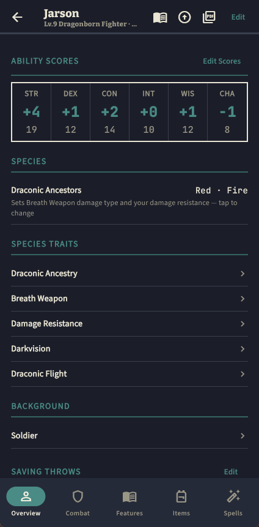
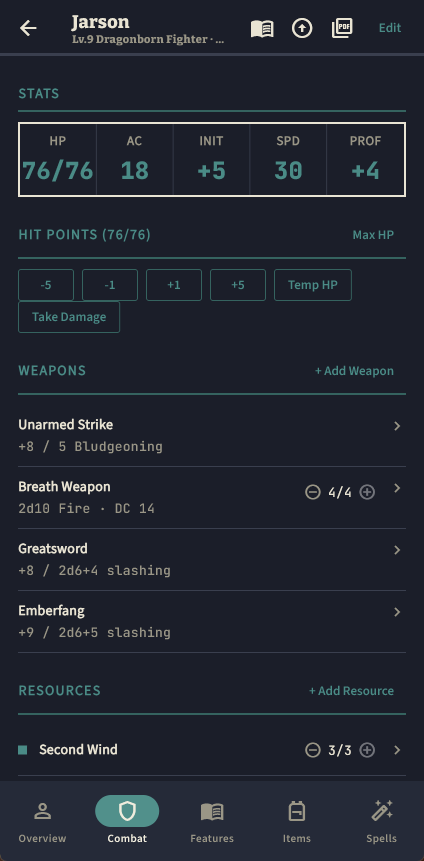
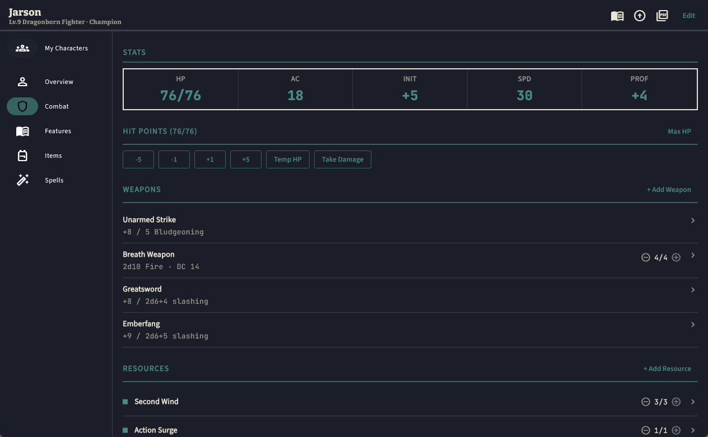
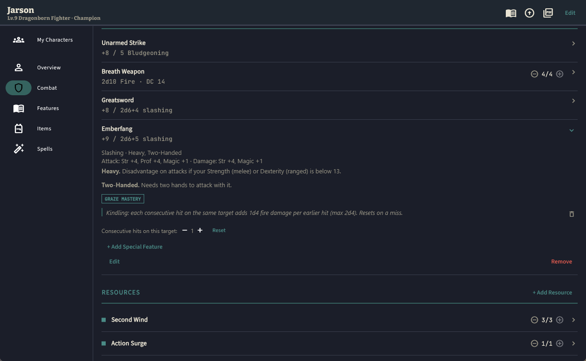
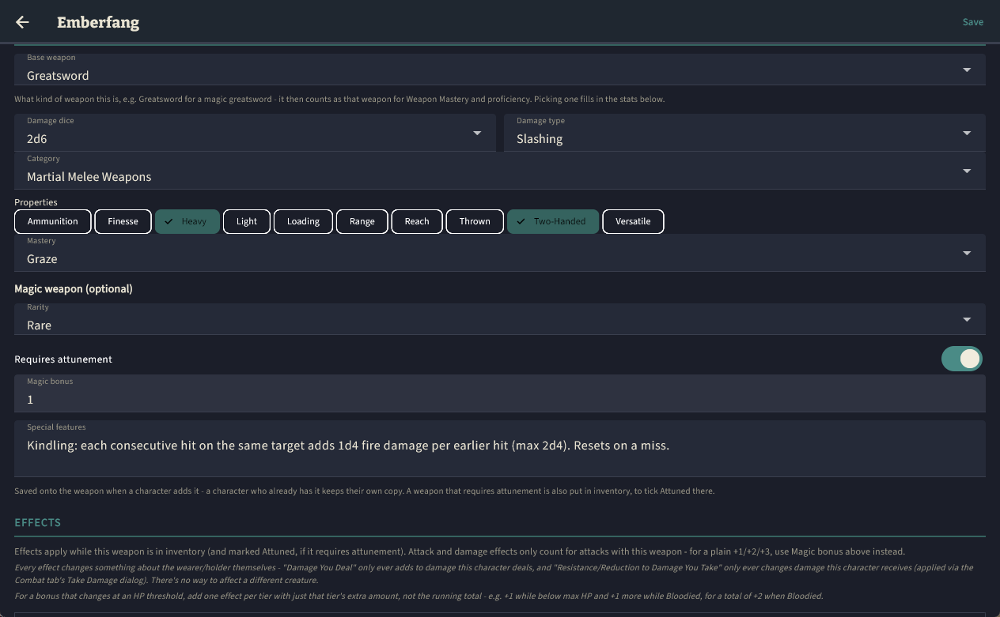
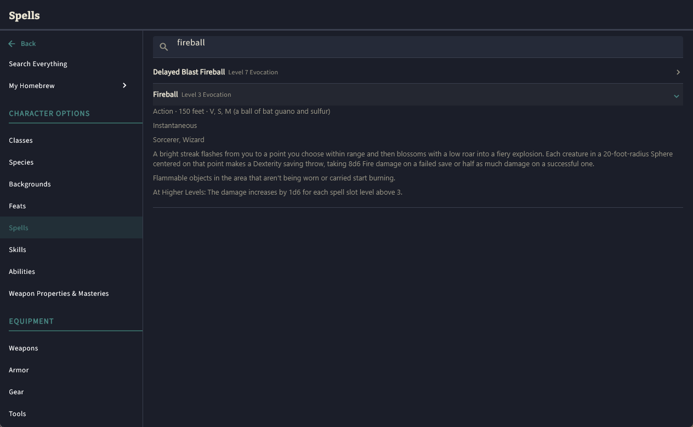

# D&D Sheet

A character sheet app for **Dungeons & Dragons 5th Edition (2024 rules)**,
for Android and Windows. It is built on the free
[System Reference Document 5.2.1](https://www.dndbeyond.com/srd), so you
can build, level and play a character without opening the Player's
Handbook. It can also print your character onto the official 2024
character sheet.

It works offline. Characters and homebrew are stored on your device, with
no account or server.

  
  

## Download and install

Get the latest version from the
**[Releases page](https://github.com/jeyeager65/dnd-sheet/releases/latest)**.

### Android

1. Download `dnd-sheet-<version>-android-arm64.apk` on your phone or
   tablet. It needs Android 7.0 or later on a 64-bit ARM device, which
   covers nearly every current phone.
2. Open the file. Android will ask you to allow installs from your
   browser or file manager (**Install unknown apps**). Allow it, then
   tap **Install**.
3. Google Play Protect may say it doesn't recognize the app, because it
   isn't from the Play Store. Choose **Install anyway**.

To update, install the new APK over the old one, which keeps your
characters. The builds aren't signed with a permanent key yet, so if
Android refuses with "App not installed" or a message about a conflict
with an existing package, **export your characters and homebrew first**,
then uninstall the old app, install the new one and import them.

### Windows

1. Download `dnd-sheet-<version>-windows-x64.zip`.
2. Unzip it anywhere, for example into your Documents folder, and run
   `dnd_sheet.exe`. Keep the files together: the program needs the
   files next to it.
3. The first time, Windows SmartScreen may say "Windows protected your
   PC", because the app isn't signed by a known publisher. Click **More
   info**, then **Run anyway**.

To update, unzip the new version over the old folder. Your characters
aren't stored in that folder, so they're kept.

## Your data and backups

Characters and homebrew are saved automatically on your device:
- **Windows:** in `%APPDATA%\Jason Yeager\D&D Sheet\`.
- **Android:** in the app's private storage.

Uninstalling the app on Android deletes them. To back up, or to move
characters between devices, use **Export** on My Characters and on My
Homebrew. Each saves a JSON file you can later **Import** on any device.
A character export includes the homebrew it uses.

The version you're running is shown under **About** (the ⓘ button on My
Characters).

## Features

**Building and leveling characters**
- Create a character from the SRD species, backgrounds, classes and
  subclasses, including starting equipment, background ability score
  increases and skill choices.
- Level up with the choices each level brings: Ability Score Improvement
  or a feat, subclass, Fighting Style, Weapon Mastery, Eldritch
  Invocations, Metamagic and other class options.
- Feat prerequisites are enforced, and a feat's own ability score
  increase is applied when you take it.
- Hit points can be rolled or averaged per level. Each level keeps a
  snapshot, so you can look back at earlier versions of a character.

**Playing**
- Track HP, Temporary HP, damage (resistances included), death saves,
  exhaustion and Hit Dice.
- Short and Long Rests show what they'll restore before you confirm.
- Limited-use resources (Channel Divinity, Focus Points, Rages, ...)
  list the features you can spend them on.
- Weapons show attack and damage breakdowns, what each weapon property
  does, and your Weapon Mastery effects.
- Spellcasting covers slots, Pact Magic, prepared spells, rituals,
  Concentration, and free casts from features and feats.
- Mounts can be tracked, and casting *Find Steed* summons your
  Otherworldly Steed with its stats worked out.
- Inventory has currency, attunement and magic items.
- A searchable **Reference** covers the SRD rules, spells, equipment,
  conditions and more.

**Character sheet PDF**
- Export your character onto the official 2024 character sheet. Long
  feature text is shortened to fit, and you can edit the short text per
  feature.

**Homebrew**
- Create your own species, backgrounds, classes, subclasses, feats,
  spells, weapons, armor, gear, tools, magic items and languages.
  Homebrew can carry real mechanics: bonuses, resistances, granted
  spells, ability score increases and option choices.
- Magic weapons can be set up in one place: the base weapon they're a
  kind of (so Weapon Mastery and proficiency apply), rarity, attunement,
  a magic bonus, special features, and effects. A special feature gives
  the weapon a consecutive-hit counter on the Combat tab.
- Mark an entry as **Official** to type in content from books you own
  that isn't in the SRD (see [Content and licensing](#content-and-licensing)).

**Sharing and backup**
- Export and import characters and homebrew as JSON files.

**Desktop**
- On a wide window, the sheet's tabs and the Reference categories move
  into a panel on the left.

## Building it yourself

See [BUILDING.md](BUILDING.md) for the repository layout, local builds,
the GitHub Actions builds and releases, and regenerating the SRD data.

## Content and licensing

**SRD content.** This work includes material from the System Reference
Document 5.2.1 ("SRD 5.2.1") by Wizards of the Coast LLC, available at
<https://www.dndbeyond.com/srd>. The SRD 5.2.1 is licensed under the
Creative Commons Attribution 4.0 International License, available at
<https://creativecommons.org/licenses/by/4.0/legalcode>.

The app shows this attribution under **About**, along with the licenses
of the packages it uses.

**Where the data comes from.** All game content comes from
[dnd-5e-srd-markdown](https://github.com/downfallx/dnd-5e-srd-markdown)
by downfallx, a Markdown conversion of SRD 5.2.1 that is itself licensed
under CC BY 4.0. It's copied into `srd-data-pull/source/srd-markdown/`,
and the scripts in `srd-data-pull/scripts/` convert it to the JSON the
app uses. That JSON is restructured from the SRD text, and the short
feature summaries in `sheet-text.json` are condensed from it.

**Non-SRD content isn't included.** The app ships only SRD content: no
text or mechanics from the Player's Handbook or other books beyond the
SRD. Content you own that isn't in the SRD, such as Great Weapon Master,
can be entered as your own **Official** homebrew. It stays in your local
data, and the optional `mobile/assets/official/content.json` is
gitignored so it's never committed. See
[`mobile/assets/official/README.md`](mobile/assets/official/README.md).
Your character and homebrew exports include whatever you've entered, so
think about that before sharing them.

**The official character sheet isn't redistributed.** Wizards of the
Coast publishes the 2024 character sheet as a free download. The app
downloads it from D&D Beyond the first time you export a PDF and caches
it on your device. It isn't included in this repository or in the builds.

**Not affiliated.** This is unofficial fan-made software. It isn't
affiliated with, endorsed, sponsored or approved by Wizards of the Coast.
Dungeons & Dragons and D&D are trademarks of Wizards of the Coast LLC.

**Third-party libraries.** PDF export uses
[Syncfusion Flutter PDF](https://pub.dev/packages/syncfusion_flutter_pdf),
which isn't open source and isn't covered by this project's MIT License.
This project's builds are made under a Syncfusion Essential Studio
Community License. If you build or redistribute the app yourself, you
need your own
[Syncfusion license](https://www.syncfusion.com/products/communitylicense),
either the free Community License if you qualify or a commercial one.
Other dependencies are listed in [`mobile/pubspec.yaml`](mobile/pubspec.yaml),
and their licenses are shown in the app under **About > View licenses**.

## License

This project's source code is licensed under the [MIT License](LICENSE).

The game content isn't covered by the MIT License. That's everything in
`mobile/assets/srd/`, `srd-data-pull/source/` and `srd-data-pull/data/`.
It's derived from the SRD and stays under
[CC BY 4.0](https://creativecommons.org/licenses/by/4.0/legalcode), with
the attribution above.
